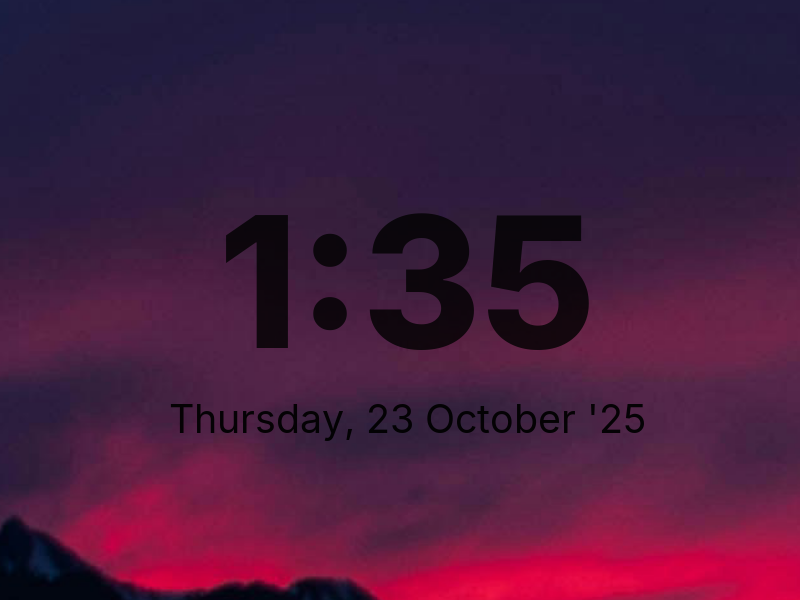

# rootclock



rootclock is a simple X program that draws a configurable clock (and optionally date) directly onto the root window of all monitors.
It is designed to run alongside dwm or other window managers, without interfering with their behavior.

## Features

* Shows a large clock centered on each monitor.
* Optional second line with the date.
* Customizable fonts, colors, and time/date formats via `config.def.h`.
* Lightweight, no dependencies beyond Xlib and Xft.

## Requirements

In order to build rootclock you need the Xlib and Xft header files.
On Debian/Ubuntu:

```
sudo apt install libx11-dev libxft-dev
```

On Fedora:

```
sudo dnf install libX11-devel libXft-devel
```

On Nix/NixOS, see the provided flake.

## Installation

Edit `config.def.h` to suit your preferences, then run:

```
make clean install
```

## Running rootclock

Add the following to your `.xinitrc` or WM startup script:

```
rootclock &
```

It will run in the background and continuously update the clock.

## Compositors

rootclock automatically detects EWMH compositing managers such as picom. When a compositor is active it draws to an unmanaged `_NET_WM_WINDOW_TYPE_DESKTOP` layer instead of the real root window, so the clock remains visible even when the compositor's overlay is in use. No extra configuration is required; if the compositor exits, rootclock falls back to painting on the root window.

## Configuration

All configuration is done by editing `config.def.h` and recompiling.
You can set:

* **Fonts** for clock and date
* **Colors** for both lines
* **Formats** (strftime strings, e.g. `%H:%M`, `%a %d.%m.%Y`)
* **Background mode** (`BG_MODE_SOLID`, `BG_MODE_COPY`, `BG_MODE_INVERT`, `BG_MODE_MULTIPLY`, `BG_MODE_SCREEN`, `BG_MODE_OVERLAY`, `BG_MODE_DARKEN`, `BG_MODE_LIGHTEN`) to control how the wallpaper blends with the glyphs. Copy/filters sample the underlying root pixmap if `_XROOTPMAP_ID` is available (falling back to the root window when needed). Invert, multiply, screen, overlay, darken, and lighten all operate only on the glyph shapes so the surrounding wallpaper stays intact and react to the configured time/date color:

  - `SOLID`: fills the whole monitor rectangle with the configured background color, then draws text normally.
  - `COPY`: copies the wallpaper into the glyph block, then draws text on top.
  - `INVERT`: runs a “difference” blend against the configured text color; colors near white give a strong invert, darker colors yield a subtle effect.
  - `MULTIPLY`: darkens the wallpaper under the glyphs using the text color as the multiplier.
  - `SCREEN`: lightens the wallpaper under the glyphs using the text color.
  - `OVERLAY`: mixes multiply/screen depending on brightness for a punchier contrast, tinted by the text color.
  - `DARKEN`: per-channel minimum between wallpaper and text color.
  - `LIGHTEN`: per-channel maximum between wallpaper and text color.

* **Block padding** (`block_padding_x`, `block_padding_y`) to adjust how much wallpaper around the text is sampled for the overlay
* Whether to show the date line

See the file for details.

## Development

If you work inside the provided `nix develop` shell you will have `clang-format`
available. A pre-commit hook is shipped under `.githooks/pre-commit` that
formats `rootclock.c` and `config.def.h` automatically. To enable it, point git
to the repository hooks directory once:

```
git config core.hooksPath .githooks
```

Subsequent `git commit` runs will format and stage the files for you.

## Further Reading

- `docs/integration.md` – how to integrate rootclock via the Nix module or a
  manual/user-level `systemd` service, plus troubleshooting tips.

## License

MIT/X Consortium License
